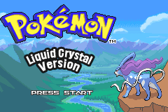

# Pokeemerald Liquid Crystal

The goal of this project is to port the ROM hack [Liquid Crystal](https://www.pokecommunity.com/threads/pok%C3%A9mon-liquid-crystal-3-3-xxxxx-live-beta.242023/) to Pokeemerald. Things will be ported over with the intent of keeping the game exactly the same, however changes will be made where things can be improved. Eventually, when the project is far enough, the goal will become to finish the game's story with the creators' intentions/Feedback in mind. Newer features like Mega Evolutions will be added later on as long as they can tie in with the story.

This project will be open source and anyone can use anything in this project as long as they give credit.

## Table of Contents

- [Screenshots](#screenshots)
- [Installation](#installation)
- [Building](#building)
- [Todo](#todo)
- [Credits](#credits)

## Screenshots



## Environment Setup

Standard pokeemerald setup instructions will work for this project.

Alternatively, my environment setup notes can be found [here](https://github.com/SirSnorealot/decomp-vscode).

## Building

**Debug build:**
```sh
make debug -j$(nproc)
```

**Release build:**
```sh
make release -j$(nproc)
```

## Todo

> A place to track things I think of so I don't forget them.

- [X] Import All Maps: SirSnorealot with the assistance of AI. (ROM Builds but maps to be more thoroughly check during scripting.)
- [ ] DNS Lights in Windows - Not started.
- [ ] Headbutt Trees - Not started.
- [ ] Region Maps - Not started.
- [ ] Pokegear - Started: SirSnorealot
- [X] Port Title Screen: SirSnorealot
- [ ] Intro before Title screen - Not started.
- [ ] New Game Intro - Not started.
- [ ] Port OW Sprites - Not started.
- [ ] Scripting - Started: SirSnorealot
- [ ] Properly implement roaming legendaries. - Not started.
- [ ] Mom Bank System - Not started.
- [ ] Players room and decorations - Not started.
- [ ] Decide how to do and implement berries and apricorns. - Not started.
- [ ] Port Pokemon Images (Disable animations?) - Not started.
- [ ] Port Trainer Sprites - Not started.
- [ ] Port Battle Backgrounds
- [ ] Port Trainer Back Sprites


## Credits

See [CREDITS.md](CREDITS.md).

